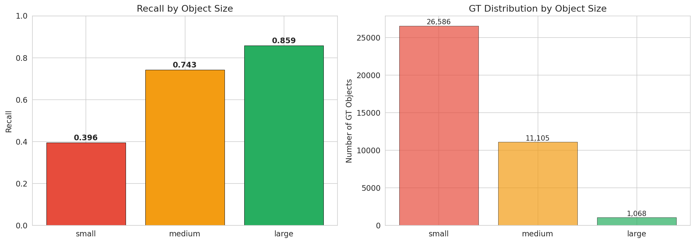
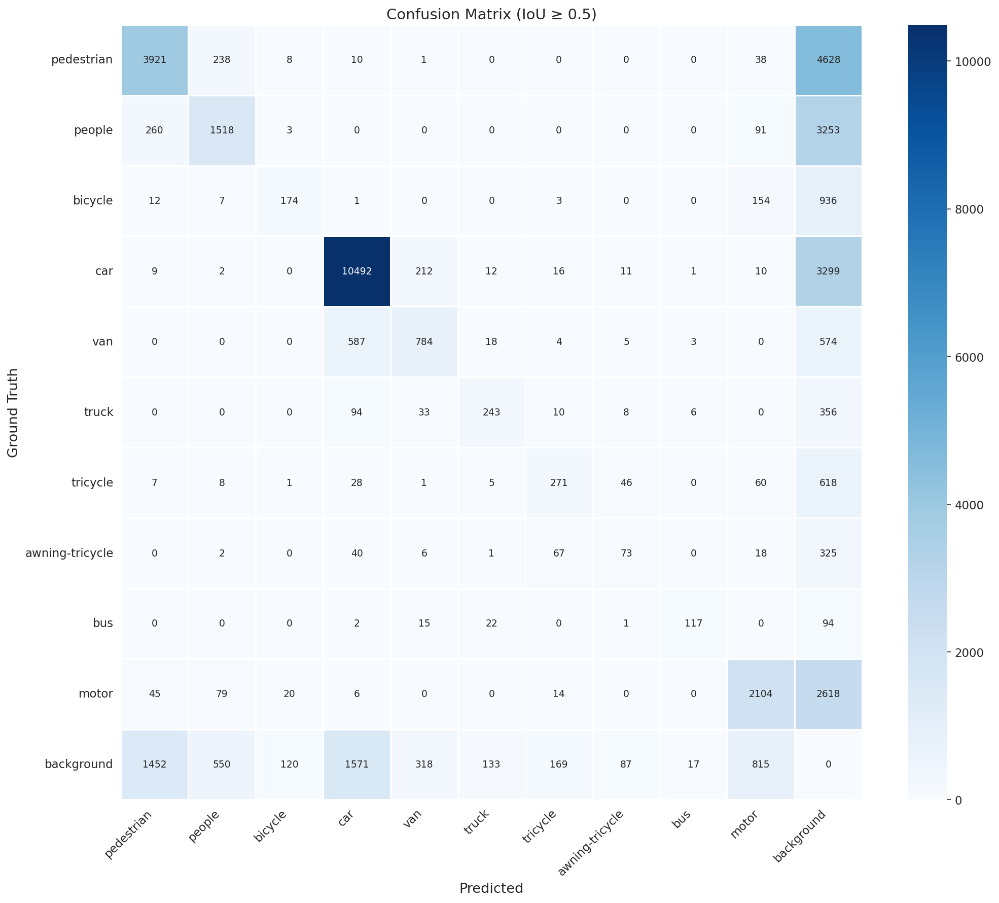
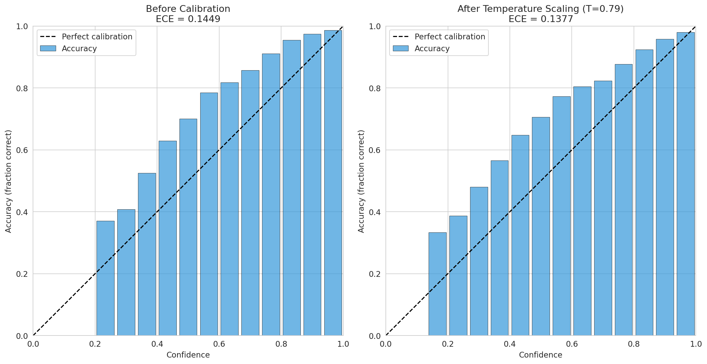
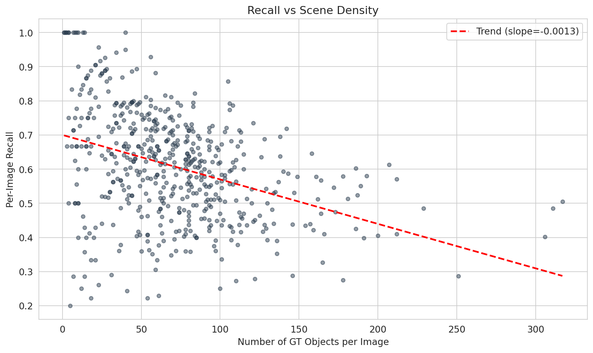

# Aerial Object Detection on VisDrone2019-DET

End-to-end detection pipeline for drone-captured imagery, built to demonstrate practical ML engineering for edge deployment on UAV platforms.

- **Model:** YOLO26n (2.5M params) 
- **Dataset:** VisDrone2019-DET (6,471 train / 548 val images, 10 classes) 
- **Best mAP@50:** 0.452 at 1280px

VisDrone is the standard benchmark for aerial object detection - small, dense, class-imbalanced targets captured from varying altitudes.

This project covers the full pipeline from EDA through deployment profiling.

## Key Results

### Model Comparison

| Model | ImgSz | mAP@50 | mAP@50-95 | Precision | Recall | Latency (ms) | Params |
|-------|-------|--------|-----------|-----------|--------|-------------|--------|
| YOLOv11n | 640 | 0.297 | 0.167 | 0.379 | 0.312 | 11.4 | 2.6M |
| YOLO26n | 640 | 0.298 | 0.166 | 0.396 | 0.309 | 13.2 | 2.5M |
| **YOLO26n** | **1280** | **0.452** | **0.277** | **0.534** | **0.439** | **18.5** | **2.5M** |

Upgrading from 640px to 1280px gave +42% relative mAP@50 improvement. Switching from YOLOv11n to YOLO26n at the same resolution gave essentially zero improvement (+0.3%) while being 16% slower. At nano scale, the parameter bottleneck nullifies architectural differences, hence resolution is the primary lever for small object detection.

### Per-Class Performance

| Class | AP@50 | AP@50-95 | Recall | Precision | F1 |
|-------|-------|----------|--------|-----------|-----|
| car | 0.835 | 0.601 | 0.746 | 0.818 | 0.780 |
| bus | 0.598 | 0.443 | 0.466 | 0.813 | 0.592 |
| pedestrian | 0.546 | 0.266 | 0.443 | 0.687 | 0.539 |
| motor | 0.523 | 0.248 | 0.431 | 0.640 | 0.515 |
| van | 0.488 | 0.354 | 0.397 | 0.572 | 0.469 |
| truck | 0.388 | 0.263 | 0.324 | 0.560 | 0.410 |
| people | 0.409 | 0.171 | 0.296 | 0.631 | 0.403 |
| tricycle | 0.339 | 0.198 | 0.259 | 0.489 | 0.339 |
| bicycle | 0.221 | 0.107 | 0.135 | 0.534 | 0.216 |
| awning-tricycle | 0.178 | 0.116 | 0.137 | 0.316 | 0.191 |

Rare classes (bicycle, awning-tricycle, tricycle) have AP@50 below 0.34, as a direct consequence of x45 class imbalance (car: 144k annotations vs awning-tricycle: 3.2k) combined with nano model capacity constraints.

### Deployment Profiling (Kaggle T4)

| Runtime | Resolution | Latency (ms) | FPS | mAP@50 | Model Size |
|---------|-----------|-------------|-----|--------|------------|
| PyTorch FP32 | 640 | 31.5 | 32 | — | 15.8 MB |
| PyTorch FP32 | 1280 | 37.2 | 27 | 0.507 | 15.8 MB |
| ONNX FP32 | 1280 | 43.1 | 23 | 0.504 | 10.3 MB |
| TensorRT FP16 | 640 | 23.1 | 43 | — | 7.5 MB |
| TensorRT FP16 | 960 | 27.5 | 36 | — | 7.5 MB |
| TensorRT FP16 | 1280 | 34.3 | 29 | 0.504 | 7.5 MB |

TensorRT FP16 at 1280px: 29 FPS with <0.6% mAP drop vs PyTorch. At 960px: 36 FPS — crosses the 30 FPS real-time threshold. FP16 quantization is essentially free on Turing/Ampere GPUs.

## Error Analysis

### Small Object Bottleneck

~70% of VisDrone annotations are small objects (<32×32 px). This drives the majority of detection failures:

| Object Size | GT Count | Recall |
|------------|---------|--------|
| Small (<32²px) | 26,586 (69%) | **0.396** |
| Medium (32²–96²px) | 11,105 (29%) | 0.743 |
| Large (≥96²px) | 1,068 (3%) | 0.859 |

96% of all missed detections (16,055 out of 16,701) are small objects. 



### Class Confusion Patterns



Three dominant confusion patterns:

**van ↔ car (587 + 212 mutual misclassifications):** Visually near-identical from drone altitude.

**pedestrian ↔ people (238 + 260):** Semantically overlapping classes - "pedestrian" (standing/walking) vs "people" (sitting/in groups) is often indistinguishable from aerial view. Merging into a single "person" class would eliminate ~500 false confusions.

**bicycle → motor (154):** Small two-wheeled vehicles are hard to differentiate at low resolution.

### Probability Calibration

YOLO confidence scores are overconfident. ECE (Expected Calibration Error) = 0.145 — meaning the model's stated confidence systematically overestimates actual accuracy.

Temperature scaling with T* = 0.79 reduces ECE by 5%, but the improvement is modest because miscalibration is class-dependent, not a simple temperature shift. Per-class calibration or Platt scaling would be needed for production use.



### Scene Density Impact

Recall degrades linearly with scene density (slope = −0.0013 per GT object). On images with 100+ objects, expected recall drops to ~0.57; at 300+ objects, to ~0.31. Contributing factors: NMS suppression in crowded regions and max_det clipping.



## Edge Deployment Recommendation

| Scenario | Hardware | Config | Expected FPS |
|----------|----------|--------|-------------|
| Reconnaissance UAV | Jetson Orin Nano 8GB | TRT-FP16 @ 1280 | ~20-25 |
| FPV drone (real-time) | Jetson Orin NX 16GB | TRT-FP16 @ 960 | ~30-40 |
| Multi-drone swarm | Jetson Orin NX 16GB | TRT-INT8 @ 640 | ~40-50 |
| Ground station | RTX 4090 / A100 | TRT-FP16 @ 1280 + SAHI | Batch |

T4 benchmarks serve as an upper-bound proxy for Jetson Orin NX.

## Project Structure

```
├── 01_01-yolo-visdrone-eda.ipynb                 # Dataset exploration & statistics
├── 02_01-yolo-visdrone-training.ipynb               # Multi-model training & evaluation
├── 03_01-yolo-visdrone-error-analysis.ipynb      # Failure modes, calibration, hard examples
├── 04_01-yolo-visdrone-deployment-profiling.ipynb  # ONNX/TensorRT export & latency profiling
├── README.md
└── figures/
```

## Technical Decisions

| Decision | Choice | Rationale |
|----------|--------|-----------|
| Model | YOLO26n (nano) | Simulate edge deployment constraints |
| Resolution | 1280px | +42% mAP over 640px; primary lever for small object recall |
| Optimizer | AdamW + cosine LR | Standard for YOLO fine-tuning, lrf=0.01 |
| max_det | 700 | VisDrone has images with 300+ objects; default 300 clips recall |

## Limitations & Next Steps

**Current limitations:**
- Small object recall capped at 0.40
- Rare (bicycle, awning-tricycle) and ambiguous (pedestrian vs people) classes effectively undetectable


## Training Details

Trained on Kaggle T4 GPU (15GB VRAM, 12h sessions). YOLO26n at 1280px with batch=4, 50 epochs, AdamW (lr=0.001), cosine schedule, mosaic augmentation (p=0.8, disabled last 10 epochs), flipud=0.3, rotation ±10°.

## Dataset

[VisDrone2019-DET](https://www.kaggle.com/datasets/banuprasadb/visdrone-dataset): 6,471 training images with ~400k bounding box annotations across 10 classes, captured from drones at varying altitudes across 14 Chinese cities. Key challenges: x45 class imbalance, ~70% small objects, up to 700+ objects per image.

